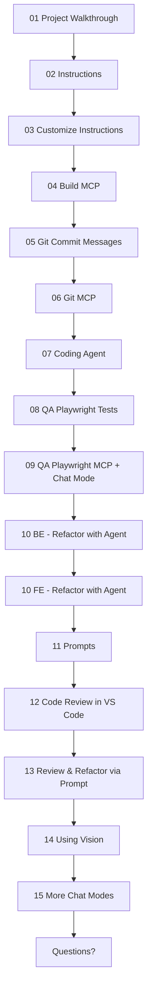

**What We"ll Cover:**

- [ ] **01 - Project Walkthrouhg**: Quick walkthrough of the project using Copilot + Running the FE/BE
- [ ] **02 - Instructions**: Generate copilot instructions for this project - using Copilot
- [ ] **03 - Cusomize Instructions**: Customize instructions with project structure, file desc + guidelines (CR, tests)
- [ ] **04 - Build MCP**: Create a Superheroes MCP to better understand the Superhero data schema
- [ ] **05 - Git Commit Messages**: Copilot can create git commit messages for us
- [ ] **06 - Git MCP**: Create and list issues in GitHub using MCP (issue: update mcp code documentation)
- [ ] **07 - Coding Agent**: assign issue directly from VS Code to Coding Agent to work in the background
- [ ] **08 - QA Playwright Tests**: Generate frontend Playwrite tests (as AI TDD)
- [ ] **09 - QA Playwright MCP + Chat Mode**: use Playwrite MCP to find more edge cases
- [ ] **10 - BE - Refactor with Agent**: instead of one-shot refactors, break down to testable parts. First - move comparison logic to backend (AI TDD)
- [ ] **10 - FE - Refactor with Agent**: Now modify FE logic to call API, keep UI as-is, run PW tests (AI TDD)
- [ ] **11 - Prompts**: use task-specific prompt to review the APIs for Security issues
- [ ] **12 - Code Review in VS Code**: review selection + review uncommited changes
- [ ] **13 - Review & Refactor via Prompt**: works in all IDEs
- [ ] **14 - Using Vision**: Using a screenshot for Design-to-Code
- [ ] **15 - More Chat Modes**: Review several modes: Plan, Debug, 4.1-Beast
- [ ] **Questions?**

---

**Key Tips & Best Practices We Covered:**
- [ ] Using instructions, prompts (all IDEs) + chatmodes (VS Code)
- [ ] Using (or building) MCPs where it makes sense
- [ ] Starting NEW sessions every time
- [ ] TDD (Test Driven Dev) as Agent stop condition and feedback loop
- [ ] Agent should run CLI commands to close feedback loop
- [ ] Multiple copilot sessions (new window)
- [ ] Choosing the right models: https://docs.github.com/en/copilot/reference/ai-models/model-comparison
- [ ] Awesome prompts+MCPs repo at https://promptboost.dev
- [ ] Optimizing prompts for GPT-5: https://cdn.openai.com/API/docs/gpt-5-for-coding-cheatsheet.pdf
- [ ] Breaking complex stuff down
- [ ] Task lists
- [ ] Never "Accpet" until happy
- [ ] Restore Checkpoint
- [ ] Use AI for reviewing code, not just generating it
- [ ] Vision for mockups, errors, flowcharts, etc