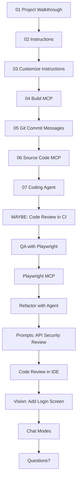

## TODOs:
- Think about paralalization - Playwrite is time consuming, we can work on backend meanwhile
We can do 07 - will work in background and end there
We can do 08+09 in parallel to 10-BE for the backend
Then we do 10-FE and use Playwright as TDD for the change
Meanwhile we do in BE 11+12 - API sec review + Code Review
- Do steps 10FE and 10BE
- Do step 12
- Do step 13
- Do step 14 - show and tell only
- Think if to show the code review in GH.com
- Update Mermaid and numbering and parallel in mermaid
- 

**What We"ll Cover:**

- [x] **01 - Project Walkthrouhg**: Quick walkthrough of the project using Copilot + Running the FE/BE
- [x] **02 - Instructions**: Generate copilot instructions for this project - using Copilot
- [x] **03 - Cusomize Instructions**: Customize instructions with project structure, file desc + guidelines (CR, tests)
- [x] **04 - Build MCP**: Create a Superheroes MCP to better understand the Superhero data schema
- [x] **05 - Git Commit Messages**: Copilot can create git commit messages for us
- [x] **06 - Source Code MCP**: Create and list issues in GitHub using MCP (issue: update mcp code documentation)
- [x] **07 - Coding Agent**: assign issue directly from VS Code to Coding Agent to work in the background
- [x] **08 - QA Playwright Tests**: Generate frontend Playwrite tests (as AI TDD)
- [x] **09 - QA Playwright MCP + Chat Mode**: use Playwrite MCP to find more edge cases
- [x] **10 - BE - Refactor with Agent**: instead of one-shot refactors, break down to testable parts. First - move comparison logic to backend (AI TDD)
- [x] **10 - FE - Refactor with Agent**: Now modify FE logic to call API, keep UI as-is, run PW tests (AI TDD)
- [x] **11 - Prompts**: use task-specific prompt to review the APIs for Security issues
- [x] **12 - Code Review in VS Code**: review selection + review uncommited changes
- [x] **13 - Review & Refactor via Prompt**: works in all IDEs
- [x] **14 - Using Vision**: Using a screenshot for Design-to-Code
- [ ] **15 - More Chat Modes**: Review several modes: Plan, Debug, 4.1-Beast - they will install
- [ ] **MAYBE: Code Review in CI**: Look at the Code Review in the CI it automatically did
- [ ] **Questions?**

---

**Key Tips & Best Practices:**
- [x] Starting new sessions every time
- [x] Agent with TDD (Test Driven Dev) as stop condition and to close feedback loops
- [x] Agent should run CLI commands to close feedback loops
- [ ] Multiple copilot sessions
- [ ] Choosing the right models: https://docs.github.com/en/copilot/reference/ai-models/model-comparison
- [ ] Awesome prompts+MCPs repo at https://promptboost.dev
- [ ] Optimizing prompts for GPT-5: https://cdn.openai.com/API/docs/gpt-5-for-coding-cheatsheet.pdf
- [ ] Breaking complex stuff down
- [ ] Task lists
- [ ] Never "Accpet" until happy
- [ ] Restore Checkpoint
- [ ] Vision for mockups, errors, flowcharts, etc
- [ ] MAYBE: Voice - you can speak when you are tired of typing!
- [ ] MAYBE: Very Advanced - Repomix?

---

**Now It's Your Turn - Try in your Own Codebase:**
(Or you can use this repo if you prefer)

* *VS Code is recommended for trying out all features
- [ ] 00 - Create a new local branch for playing around (e.g. "copilot-playground")
- [ ] 01 - Generate your own copilot instructions MD for your repo (VS Code only)
- [ ] NOT SURE Ext. - 02 - Use Voice - use the "mic" icon and ask copilot about your project (VS Code only)
- [ ] 03 - Generate tests & iterate until they pass (either unit or playwright) for some functionality
**Bonus** - use Playwright MCP
https://github.com/microsoft/playwright-mcp
- [ ] 04 - Perfrom a Code Review on a selected piece of code (VS Code feature)
- [ ] 05 - Perfrom a Review & Refactor via modifying this reusable prompt
https://github.com/github/awesome-copilot/blob/main/prompts/review-and-refactor.prompt.md?plain=1
- [ ] 06 - Plan a task using GPT-5 (no coding) using Plan chatmode (VS Code only)
https://github.com/github/awesome-copilot/blob/main/chatmodes/plan.chatmode.md?plain=1
- [ ] 07 - Try Vision with GPT-4.1 - paste a UI screenshot or a diagram and ask about it
*NOTE: In JetBrains you have to copy image into the project files
- [ ] 08 - Set up your GPT-4.1 Beast chatmode (VS Code only)
https://promptboost.dev/chat-modes/beast-mode 

