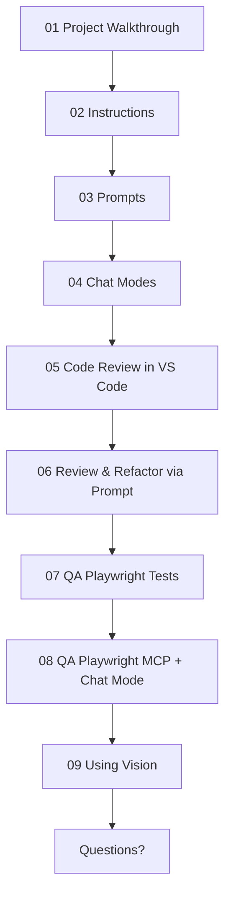

**What We"ll Cover:**

- [ ] [01 Project Walkthrouhg](prompts/01-project-overview.md): Quick walkthrough of the project using Copilot + Running the FE/BE
- [ ] [02 Instructions](prompts/02-generate-instructions.md): Generate copilot instructions for this project - using Copilot
- [ ] [03 Prompts](prompts/11.1-api-security-review.prompt.md): use task-specific prompt to review the APIs for Security issues
- [ ] 04 Chat Modes: Review several modes: Plan, Debug, 4.1-Beast
- [ ] 05 Code Review in VS Code: review selection + review uncommited changes
- [ ] [06 Review & Refactor via Prompt](prompts/13-review-and-refactor.prompt.md): works in all IDEs
- [ ] [07 QA Playwright Tests](prompts/09-a-playwright-mcp-with-chatmode-vsc.md): Generate frontend Playwrite tests (as AI TDD)
- [ ] [08 QA Playwright MCP + Chat Mode](prompts/09-b-playwright-mcp-reusable.prompt.md): use Playwrite MCP to add more edge cases
- [ ] [09 Using Vision](prompts/14-vision-design-to-code.md): Using a screenshot for Design-to-Code
- [ ] **Questions?**

---

**Key Tips & Best Practices We Covered:**
- [ ] Using instructions, prompts (all IDEs) + chatmodes (VS Code)
- [ ] Using (or building) MCPs where it makes sense
- [ ] Starting NEW sessions every time
- [ ] TDD (Test Driven Dev) as Agent stop condition and feedback loop
- [ ] Agent should run CLI commands to close feedback loop
- [ ] Multiple copilot sessions (new window)
- [ ] Choosing the right models: https://docs.github.com/en/copilot/reference/ai-models/model-comparison
- [ ] Awesome prompts+MCPs repo at https://promptboost.dev
- [ ] Optimizing prompts for GPT-5: https://cdn.openai.com/API/docs/gpt-5-for-coding-cheatsheet.pdf
- [ ] Breaking complex stuff down
- [ ] Task lists
- [ ] Never "Accpet" until happy
- [ ] Restore Checkpoint
- [ ] Use AI for reviewing code, not just generating it
- [ ] Vision for mockups, errors, flowcharts, etc